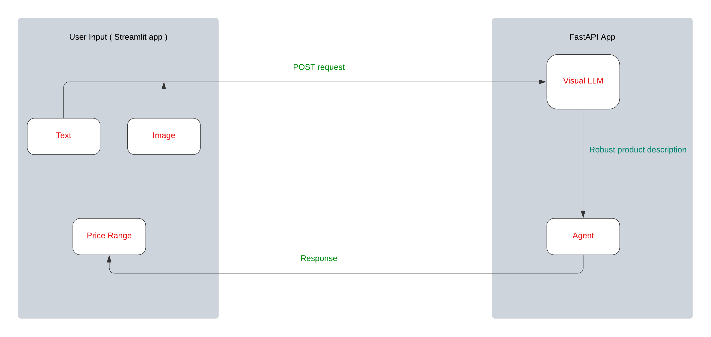

# ECommerce Pricing

This repo contains the code and the implementation of the ecommerce pricing project.

## Introduction

The ecommerce pricing project harnesses the power of FastAPI, Streamlit, a Visual Large Language Model (VLLM), and an agent to efficiently determine the price range of a product based on its image and text description. This project is designed to offer a user-friendly interface for precise and efficient product price discovery using state-of-the-art natural language processing techniques.



Here's how it works: Users input a product image and its description into the Streamlit app. Upon submission, a POST request is sent to the FastAPI app where the pipeline is initiated. The product image is analyzed by the visual VLLM to extract detailed information about the product. These details are then combined with the description to create a more comprehensive product overview.

Next, this enhanced description is passed to an agent equipped with a search tool: searching the internet. The agent conducts the search to identify similar products and then determines a price range based on its findings and comparison to similar products. Once completed, the agent returns the price range along with the rationale behind it to the user.


## Prerequisites

- Python 3.9 or higher
- Poetry (for dependency management)
- Docker (if running the project with Docker)


## Usage

To implement the project, first clone the repo and navigate to this branch. Then:

### Option 1: Without Docker

1. Create a .env file in the project root directory and populate it with the required API keys and tokens as shown below:

    ```plaintext
    LANGCHAIN_API_KEY="your_langchain_api_key"
    LANGCHAIN_PROJECT="price-discovery"
    LANGCHAIN_TRACING_V2="true"
    GOOGLE_API_KEY="your_google_api_key"
    SERPAPI_API_KEY="your_serpapi_api_key"
    ```

    - For the langchain API key, check [here](https://docs.smith.langchain.com/setup). This will be used for monitoring on langsmith.

    - For the google API key check [here](https://aistudio.google.com/app/prompts/new_chat/?utm_source=agd&utm_medium=referral&utm_campaign=core-cta&utm_content=). This will be used for Gemini.
    - For the serp API key check [here](https://serpapi.com/). This will be used for creating a search tool.


2. Install Poetry and set up the project dependencies:

     ```bash
    pip install poetry
    poetry config virtualenvs.in-project true
    poetry install
    poetry shell
    pip install streamlit fastapi
    ```


3. In the `config.yaml` file in the `configs` folder, change the `endpoint_url` under `streamlit_app` to `"http://localhost:8000/invoke"`.

     ```yaml
    streamlit_app:
        endpoint_url: "http://localhost:8000/invoke"
    ```

4. Start the FastAPI and Streamlit applications

    - In one start the fastapi server:

        ```bash
      poetry run uvicorn fastapi_app:app --reload
      ```

    - In the second one start the sreamlit app:

        ```bash
      poetry run streamlit run streamlit_app.py
      ```

5. Access the applications via the urls provided once the startup is complete.

6. Upload product image and product description via the streamlit app  and view results.


### Option 2: With Docker

1. Create a .env file in the project root directory and populate it with the required API keys and tokens (same as in Option 1).

2. In the `config.yaml` file in the `configs` folder, change the `endpoint_url` under `streamlit_app` to `"http://fastapi:8000/invoke"`. This allows the Streamlit app to communicate with the FastAPI app running in the Docker container.

    ```yaml
    streamlit_app:
        endpoint_url: "http://fastapi:8000/invoke"
    ```

3. Change the name `repo` in the `docker-compose.yml` to your own repo name in docker.

4. Build up the Docker images:

     ```bash
    make build
    ```

    The `make build` command builds the Docker images for the project.

5. Run the Docker image:

    ```bash
    make run
    ```

    The `make run` command starts the Docker container and maps the necessary ports for the FastAPI and Streamlit applications.


6. Access the applications:
    - FastAPI app: <http://localhost:8000>

    - Streamlit app: <http://localhost:8501>

7. Upload product image and product description via the streamlit app and view results.

8. Clean up after.
    ```bash
    make stop

    make clean
    ```

